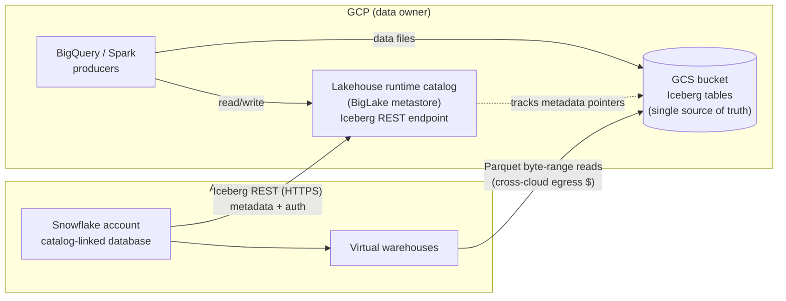
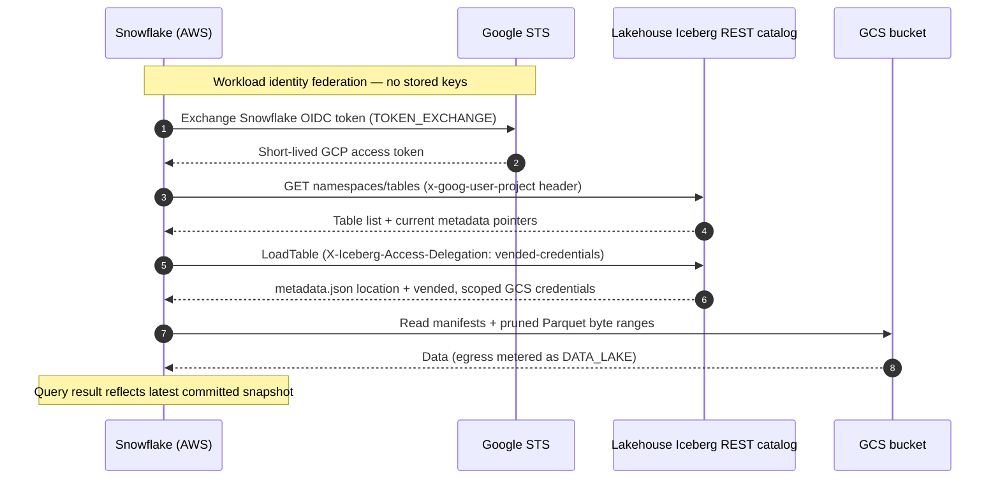
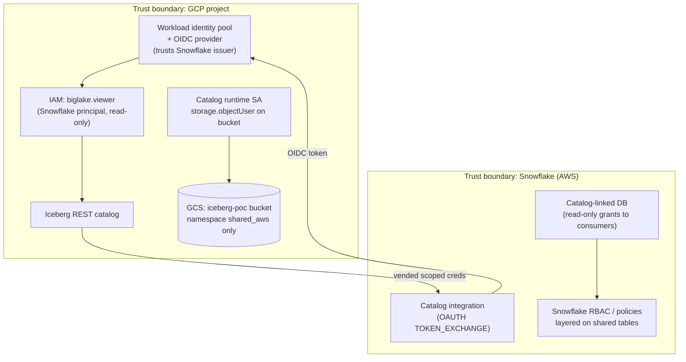
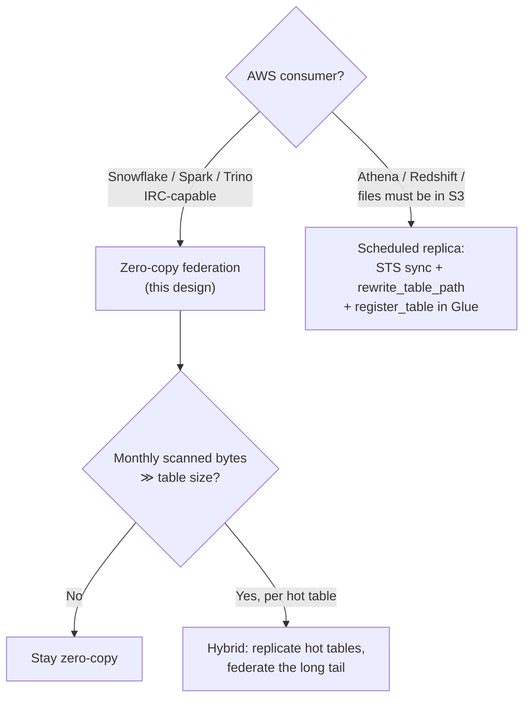

# Architecture Overview

Diagrams for ARB review. Mermaid sources render natively on GitHub. See `docs/adr/` for the decisions behind each element.

## 1. System context

Data never leaves GCS. Snowflake discovers tables through the REST catalog and scans Parquet in place.

## 2. Authentication & query sequence

## 3. Deployment / trust boundaries

Control points: the shared namespace is the contract boundary; `biglake.viewer` caps the blast radius at read-only; credential vending removes standing storage credentials from the AWS side.

## 4. Consumption-pattern decision

