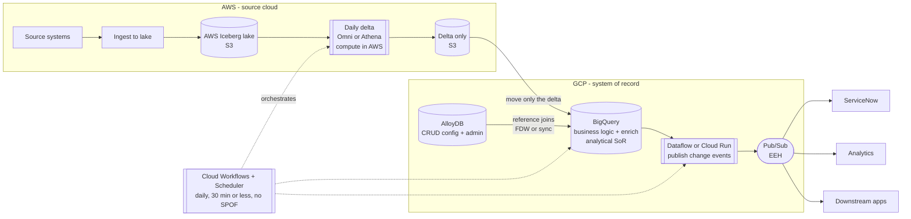

# Daily Cross-Cloud Delta Pipeline — Architecture Recommendation

A worked solution design that applies this repo's cross-cloud findings (BigQuery
Omni, Iceberg snapshot diffs, the AlloyDB FDW) to a concrete requirement:
detect day-over-day changes in an **AWS** data lake and serve the results from
**GCP**.

## The use case

```
source systems -> ingest to AWS data lake ->
daily delta (changes since prior day) -> persist for next-day compare ->
apply business logic + config rules (GCP-side) -> enrich with other sources ->
store output in GCP -> publish to the enterprise event hub (EEH) ->
consumers (ServiceNow, analytics, downstream apps)
```

Requirements: day-over-day comparison ("CDC", though it is really snapshot-diff
delta detection); **minimize data movement**; persistent storage in **GCP**
(open to BigQuery); **CRUD** support; publish to **EEH**; deliver to
**ServiceNow**; run **daily in ≤ 30 minutes with no single point of failure**.

## Governing principle

*Minimize data movement* and *store in GCP* conflict: the source is in AWS, the
system of record is in GCP, so **some cross-cloud movement is unavoidable**.
"Minimize" therefore resolves to one rule:

> **Move only the daily delta, not the full snapshot — and compute that delta
> where the data already lives (AWS).**

If the diff runs in GCP you must ship the full snapshot across every day, which
is the exact thing to avoid. If the AWS lake is **Iceberg**, "compare to prior
day" is a comparison of two snapshots (time-travel) — you may not need to persist
yesterday's copy at all.

## Reference architecture



| Flow step | Tool | Notes |
|---|---|---|
| Ingest to AWS lake | AWS-native (as-is) | Land as **Iceberg** — makes the diff cheap |
| Daily delta / "CDC" | **Omni or Athena**, in AWS | Compute in place; emit only the delta. Iceberg snapshot compare if available |
| Persist for next-day compare | S3 (Iceberg history) | No extra copy if Iceberg; else a dated snapshot in S3 |
| Move delta to GCP | CTAS / cross-cloud transfer | One hop, delta-sized, into **BigQuery** |
| Business logic + config rules | **BigQuery** SQL | Joins to admin/config tables; `MERGE` for transforms |
| Enrich with other sources | **BigQuery** joins | "Enrich" = join the delta to reference/master data |
| Store output | **BigQuery** (analytical SoR) + **AlloyDB** (if CRUD) | See Decision D2 |
| Publish to EEH | **Dataflow or Cloud Run → Pub/Sub** | One change-event per delta row |
| ServiceNow + consumers | Subscribe to the EEH | Decouple ServiceNow behind Pub/Sub |
| Orchestration | **Cloud Workflows + Scheduler** (or Composer) | All components serverless / no SPOF |

## Where BigQuery Omni fits

- **As the diff-pushdown engine: yes.** It runs the day-over-day scan inside AWS
  and returns only the delta — directly serving "minimize movement," in BigQuery
  SQL owned by the GCP team. (See [runbook-omni-reverse.md](runbook-omni-reverse.md).)
- **As the platform/store/serving/CRUD layer: no.** Read-only, region-locked,
  analytics-grade, can't do CRUD, can't feed Pub/Sub or ServiceNow. It is a
  query tool, not a system of record. See
  [adr-omni-reverse/](adr-omni-reverse/) for the proven limits.

## Decision log

### D1 — Delta-compute engine: BigQuery Omni vs AWS-native (Athena/Glue/Spark)

**Status: OPEN — decide by team ownership.** Both compute the delta in AWS and
move only the result, so both satisfy the movement objective.

| | BigQuery Omni | Athena / Glue / Spark |
|---|---|---|
| Owner | GCP data team, one SQL control plane spanning both clouds | AWS data-eng team, native to the lake |
| Maturity | Newer; region-locked, feature-limited (no DML/ML/streaming) | Mature, full-featured on Iceberg |
| Result landing | One `CREATE TABLE AS SELECT` into BigQuery | Delta to S3, then load/transfer to BigQuery |

**Recommendation:** Omni if the pipeline is GCP-team-owned end to end; Athena/Glue
if the lake team is on AWS and you want to avoid Omni's constraints.

### D2 — CRUD store: BigQuery-only vs BigQuery + AlloyDB

**Status: OPEN — needs the customer to define "CRUD".** This is the highest-leverage
decision.

- CRUD = **batch upsert of the daily delta** → **BigQuery `MERGE`**; no second store.
- CRUD = **interactive, low-latency, row-level** updates (human-maintained config/
  admin tables, or records ServiceNow edits back) → **AlloyDB** (BigQuery is not
  OLTP). BigQuery can read AlloyDB live via the `bigquery_fdw`
  ([verified](adr-omni-reverse/R003-materialize-for-native-consumers.md)) or you
  sync it.

**Recommendation:** most likely a **hybrid** — BigQuery as the analytical delta
store, AlloyDB for CRUD config/admin and any operational serving. Confirm the
meaning of CRUD before committing.

## Non-functional notes

- **≤ 30 min / no SPOF:** every component (BigQuery, Dataflow, Cloud Run, Pub/Sub,
  Workflows) is serverless / autoscaling. The SPOF risk hides in the **fan-out**:
  use a Pub/Sub dead-letter topic, idempotent publish keyed by record id, and
  retries on the ServiceNow call.
- **"Lake → analytical → events" is not weird** — it is *compute deltas in batch,
  then emit them as discrete change events*. Standard integration shape.
- **EEH = Pub/Sub?** Probably. If your EEH is managed Kafka/Confluent or Azure
  Event Hubs, the fan-out target changes (Dataflow can write to Kafka), but the
  pattern is identical.

## Open upstream question

They call it CDC but it is **daily full-snapshot delta detection**. If the source
systems can emit real change logs (Datastream / Debezium / native CDC), you skip
the expensive daily full-snapshot compare entirely and stream only changes —
less movement and less cost. Worth asking before building the snapshot-diff.
