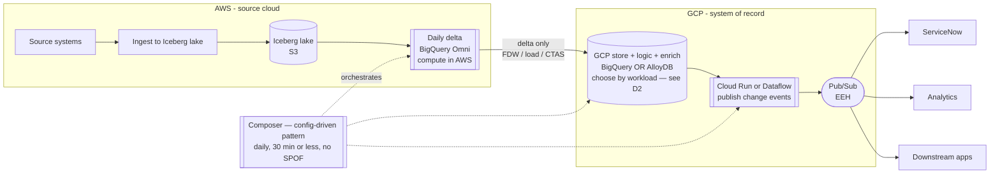

# Daily Cross-Cloud Delta Pipeline — Architecture Recommendation

A worked solution design that applies this repo's cross-cloud findings (BigQuery
Omni, Iceberg snapshot diffs, the AlloyDB FDW) to a concrete requirement:
detect day-over-day changes in an **AWS** data lake and serve the results from
**GCP**.

## The use case

```
source systems -> ingest to AWS data lake ->
daily delta (changes since prior day) -> persist for next-day compare ->
apply business logic + config rules (GCP-side) -> enrich with other sources ->
store output in GCP -> publish to the enterprise event hub (EEH) ->
consumers (ServiceNow, analytics, downstream apps)
```

Requirements: day-over-day comparison ("CDC", though it is really snapshot-diff
delta detection); **minimize data movement**; persistent storage in **GCP**
(open to BigQuery); **CRUD** support; publish to **EEH**; deliver to
**ServiceNow**; run **daily in ≤ 30 minutes with no single point of failure**.

## Governing principle

*Minimize data movement* and *store in GCP* conflict: the source is in AWS, the
system of record is in GCP, so **some cross-cloud movement is unavoidable**.
"Minimize" therefore resolves to one rule:

> **Move only the daily delta, not the full snapshot — and compute that delta
> where the data already lives (AWS).**

If the diff runs in GCP you must ship the full snapshot across every day, which
is the exact thing to avoid. If the AWS lake is **Iceberg**, "compare to prior
day" is a comparison of two snapshots (time-travel) — you may not need to persist
yesterday's copy at all.

## Reference architecture



| Flow step | Tool | Notes |
|---|---|---|
| Ingest to AWS lake | AWS-native (as-is) | Land as **Iceberg** — makes the diff cheap |
| Daily delta / "CDC" | **BigQuery Omni**, in AWS | Compute the day-over-day diff in place; emit only the delta. Iceberg snapshot compare if available |
| Persist for next-day compare | S3 (Iceberg history) | No extra copy if Iceberg; else a dated snapshot in S3 |
| Move delta to GCP | FDW pull (small delta) or CTAS + bulk load (large) | One hop, delta-sized |
| Business logic + config rules | **BigQuery or AlloyDB** SQL | In the chosen store (D2) — joins to admin/config tables |
| Enrich with other sources | **BigQuery or AlloyDB** joins | Join the delta to reference/master data |
| Store output | **BigQuery or AlloyDB** | Choose by workload — see D2 |
| Publish to EEH | **Cloud Run job** (or Dataflow) → Pub/Sub | Read the result table, one change-event per row |
| ServiceNow + consumers | Subscribe to the EEH | Decouple ServiceNow behind Pub/Sub |
| Orchestration | **Composer** — a new config-driven pattern | Reuses existing framework (scheduling, alerting, error-analyzer). See "Framework fit" |

## Where BigQuery Omni fits

- **As the diff-pushdown engine: yes.** It runs the day-over-day scan inside AWS
  and returns only the delta — directly serving "minimize movement," in BigQuery
  SQL owned by the GCP team. (See [runbook-omni-reverse.md](runbook-omni-reverse.md).)
- **As the platform/store/serving/CRUD layer: no.** Read-only, region-locked,
  analytics-grade, can't do CRUD, can't feed Pub/Sub or ServiceNow. It is a
  query tool, not a system of record. See
  [adr-omni-reverse/](adr-omni-reverse/) for the proven limits.

## Decision log

### D1 — Delta-compute engine → BigQuery Omni

**Status: DECIDED — BigQuery Omni.** The diff runs in AWS via Omni (SQL
pushdown), so only the delta crosses to GCP, in a BigQuery control plane owned by
the GCP team. Accept Omni's constraints (region-locked, read-only,
analytics-grade, no DML/ML/streaming) — they don't bind the *diff* step, which is
a batch `SELECT`. See [runbook-omni-reverse.md](runbook-omni-reverse.md).

### D2 — GCP-side store: BigQuery or AlloyDB (choose by workload)

**Status: DECISION FRAMEWORK — pick per feed (it's a pattern config field, not a
one-time platform choice).** Both are valid GCP stores for the delta output;
the pattern (below) exposes `target.store: bigquery | alloydb`.

| Choose **BigQuery** when | Choose **AlloyDB** when |
|---|---|
| Output is analytical (BI, reporting, large scans) | Output needs interactive, row-level **CRUD** |
| "CRUD" = **batch upsert** (`MERGE` the delta) | Users/apps maintain config/admin records live |
| Consumers are analytics / warehouse-first | Operational serving, low-latency point reads |
| Fewer moving parts, fully serverless | ServiceNow-style record lifecycle in the DB |
| Large deltas (native scale, no FDW bottleneck) | Modest deltas (FDW pull) or bulk-load for large |

Run **both** only if you genuinely have heavy-BI *and* interactive-CRUD needs:
AlloyDB for CRUD/serving + BigQuery for analytics (AlloyDB → BQ copy, or BQ reads
AlloyDB via the FDW). Default to one store.

Guardrails either way:

- **Delta volume vs FDW throughput.** AlloyDB's `bigquery_fdw` pulls via serial
  `getQueryResults` — fine for a modest delta, a bottleneck for a large one; for
  big deltas, materialize Omni → native BQ table → bulk-load AlloyDB (`COPY`).
- **Colocation.** Landing the Omni delta in BigQuery uses a cross-cloud transfer
  to the colocated region (`us-east4` for `aws-us-east-1`), not `us-east1`.

## Framework fit — a new config-driven pattern, not a one-off

This must slot into the existing **Composer** orchestration framework
(config-driven: *"describe a pipeline in a small YAML file, and the framework
turns it into a runnable, scheduled pipeline"*), alongside the `gcs_to_bigquery`
and `dataform` patterns — **not** a bespoke DAG.

Add it as a new pattern, `cross_cloud_delta`, following the existing structure:

- `composer/dags/configs/cross_cloud_delta/<feed>.yaml` — one config per feed
- `composer/dags/utils/cross_cloud_delta_utils.py` — `build_execution_string()`
  + the launcher (run the Omni diff, land the delta to the chosen store, publish
  to the EEH), mirroring `gcs_to_bigquery_utils.py`
- register it in the DAG factory's execution dispatch

The DAG reuses the framework's **scheduling, alerting, and the shared
error-analyzer** for free. A new cross-cloud feed then becomes *one YAML file*:

```yaml
# configs/cross_cloud_delta/orders_delta.yaml
dag_attr:
  tags: [{ name: "orders" }, { name: "cross-cloud" }]
  alert_after_run_minutes: 25
workflow_type: "omni_delta"
schedules:
  - interval: "0 5 * * *"
    timezone: "America/New_York"
    executions:
      cross_cloud_delta:
        source:                              # AWS Iceberg lake via BigQuery Omni
          omni_connection: "aws-us-east-1.omni_s3_conn"
          dataset: "omni_s3"
          table: "orders"
          key_columns: ["order_id"]
          compare: "snapshot"                # day-over-day (or iceberg_snapshot)
        target:                              # GCP store — the D2 choice, per feed
          store: "bigquery"                  # bigquery | alloydb
          dataset: "curated"
          table: "orders_delta"
          write: "merge"
        enrich:
          config_tables: ["ref.customer_dim"]
        sink:
          topic: "projects/{{ project }}/topics/orders-changes"   # EEH
```

That is the answer to "am I building a one-off": no — you are adding **one
pattern** to the framework, after which every cross-cloud delta feed is
config-only. The `store` field makes D2 a per-feed decision, not a platform fork.

### D3 — Pipeline shape: orchestrated-with-Omni vs single-engine-without-Omni

**Status: DECIDED — orchestrated, because Omni is required (D1).** Omni is a SQL
query step, not a Beam/Spark source, so "use Omni" and "one Dataflow/Spark job"
do not coexist:

- **(a) Orchestrated, with Omni (chosen):** Omni diff → land delta → store
  logic/CRUD → publisher → Pub/Sub, sequenced by the **Composer
  `cross_cloud_delta` pattern** (see Framework fit). Multiple serverless steps,
  Omni included.
- **(b) Single Spark/Dataflow job, no Omni:** read the S3 Iceberg delta
  **directly** (S3/Iceberg connector, bypassing Omni) → transform → AlloyDB +
  Pub/Sub. One job, but Omni is out — and Spark/Dataflow can't read Omni anyway
  (the spark-bigquery connector and `BigQueryIO` both use the Storage Read API,
  which Omni doesn't support). Keep (b) in reserve if the "single engine"
  constraint ever outweighs the "use Omni" one.

Note on "Dataflow reading Omni via AlloyDB": technically possible (Dataflow
`JdbcIO` → AlloyDB → FDW → Omni) and the only way to put Omni inside a Dataflow
read — but it chains three systems synchronously and bottlenecks on the FDW.
Prefer **staging**: AlloyDB lands the delta as a native table, then a Cloud Run
job (or Dataflow) reads *that* to publish.

## Non-functional notes

- **≤ 30 min / no SPOF:** the serverless components (Omni/BigQuery, Cloud Run,
  Pub/Sub, Workflows) are multi-zone with no single point of failure — BigQuery
  is effectively active-active across zones within a region (99.99% SLA; a region
  is the failure domain, cross-region needs opt-in managed DR). **AlloyDB is the
  one component you must configure for HA** — enable the regional
  primary + standby (automatic zonal failover); that is active-standby, not
  multi-master, but it satisfies no-SPOF. The remaining SPOF risk hides in the
  **fan-out**: use a Pub/Sub dead-letter topic, idempotent publish keyed by
  record id, and retries on the ServiceNow call.
- **"Lake → analytical → events" is not weird** — it is *compute deltas in batch,
  then emit them as discrete change events*. Standard integration shape.
- **EEH = Pub/Sub?** Probably. If your EEH is managed Kafka/Confluent or Azure
  Event Hubs, the fan-out target changes (Dataflow can write to Kafka), but the
  pattern is identical.

## Open upstream question

They call it CDC but it is **daily full-snapshot delta detection**. If the source
systems can emit real change logs (Datastream / Debezium / native CDC), you skip
the expensive daily full-snapshot compare entirely and stream only changes —
less movement and less cost. Worth asking before building the snapshot-diff.
