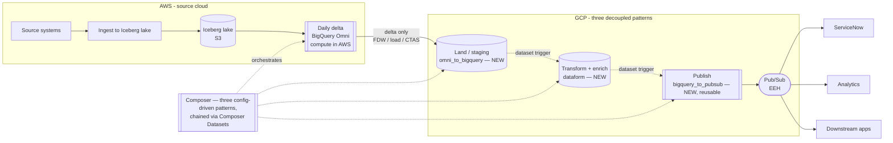

# Daily Cross-Cloud Delta Pipeline — Architecture Recommendation

A worked solution design that applies this repo's cross-cloud findings (BigQuery
Omni, Iceberg snapshot diffs, the AlloyDB FDW) to a concrete requirement:
detect day-over-day changes in an **AWS** data lake and serve the results from
**GCP**.

## The use case

```
source systems -> ingest to AWS data lake ->
daily delta (changes since prior day) -> persist for next-day compare ->
apply business logic + config rules (GCP-side) -> enrich with other sources ->
store output in GCP -> publish to the enterprise event hub (EEH) ->
consumers (ServiceNow, analytics, downstream apps)
```

Requirements: day-over-day comparison ("CDC", though it is really snapshot-diff
delta detection); **minimize data movement**; persistent storage in **GCP**
(open to BigQuery); **CRUD** support; publish to **EEH**; deliver to
**ServiceNow**; run **daily in ≤ 30 minutes with no single point of failure**.

## Governing principle

*Minimize data movement* and *store in GCP* conflict: the source is in AWS, the
system of record is in GCP, so **some cross-cloud movement is unavoidable**.
"Minimize" therefore resolves to one rule:

> **Move only the daily delta, not the full snapshot — and compute that delta
> where the data already lives (AWS).**

If the diff runs in GCP you must ship the full snapshot across every day, which
is the exact thing to avoid. If the AWS lake is **Iceberg**, "compare to prior
day" is a comparison of two snapshots (time-travel) — you may not need to persist
yesterday's copy at all.

## Reference architecture



| Flow step | Tool | Notes |
|---|---|---|
| Ingest to AWS lake | AWS-native (as-is) | Land as **Iceberg** — makes the diff cheap |
| Daily delta / "CDC" | **BigQuery Omni**, in AWS | Compute the day-over-day diff in place; emit only the delta. Iceberg snapshot compare if available |
| Persist for next-day compare | S3 (Iceberg history) | No extra copy if Iceberg; else a dated snapshot in S3 |
| Move delta to GCP + land | `omni_to_bigquery` pattern (**new**) | FDW pull or CTAS + bulk load, into the chosen store (D2); emits a dataset-update on success |
| Business logic + config rules + enrich | `dataform` pattern (**new**) | Triggered by the landed dataset; joins to admin/config/reference tables |
| Store output | **BigQuery or AlloyDB** | Choose by workload — see D2 |
| Publish to EEH | `bigquery_to_pubsub` pattern (**new, reusable**) | Triggered by the curated dataset; one change-event per row |
| ServiceNow + consumers | Subscribe to the EEH | Decouple ServiceNow behind Pub/Sub |
| Orchestration | **Composer** — three config-driven patterns | Chained via Composer Datasets, not one monolithic DAG. See "Framework fit" |

## Where BigQuery Omni fits

- **As the diff-pushdown engine: yes.** It runs the day-over-day scan inside AWS
  and returns only the delta — directly serving "minimize movement," in BigQuery
  SQL owned by the GCP team. (See [runbook-omni-reverse.md](runbook-omni-reverse.md).)
- **As the platform/store/serving/CRUD layer: no.** Read-only, region-locked,
  analytics-grade, can't do CRUD, can't feed Pub/Sub or ServiceNow. It is a
  query tool, not a system of record. See
  [adr-omni-reverse/](adr-omni-reverse/) for the proven limits.

## Decision log

### D1 — Delta-compute engine → BigQuery Omni

**Status: DECIDED — BigQuery Omni.** The diff runs in AWS via Omni (SQL
pushdown), so only the delta crosses to GCP, in a BigQuery control plane owned by
the GCP team. Accept Omni's constraints (region-locked, read-only,
analytics-grade, no DML/ML/streaming) — they don't bind the *diff* step, which is
a batch `SELECT`. See [runbook-omni-reverse.md](runbook-omni-reverse.md).

### D2 — GCP-side store: BigQuery or AlloyDB (choose by workload)

**Status: DECISION FRAMEWORK — pick per feed (it's a pattern config field, not a
one-time platform choice).** Both are valid GCP stores for the delta output;
the pattern (below) exposes `target.store: bigquery | alloydb`.

| Choose **BigQuery** when | Choose **AlloyDB** when |
|---|---|
| Output is analytical (BI, reporting, large scans) | Output needs interactive, row-level **CRUD** |
| "CRUD" = **batch upsert** (`MERGE` the delta) | Users/apps maintain config/admin records live |
| Consumers are analytics / warehouse-first | Operational serving, low-latency point reads |
| Fewer moving parts, fully serverless | ServiceNow-style record lifecycle in the DB |
| Large deltas (native scale, no FDW bottleneck) | Modest deltas (FDW pull) or bulk-load for large |

Run **both** only if you genuinely have heavy-BI *and* interactive-CRUD needs:
AlloyDB for CRUD/serving + BigQuery for analytics (AlloyDB → BQ copy, or BQ reads
AlloyDB via the FDW). Default to one store.

Guardrails either way:

- **Delta volume vs FDW throughput.** AlloyDB's `bigquery_fdw` pulls via serial
  `getQueryResults` — fine for a modest delta, a bottleneck for a large one; for
  big deltas, materialize Omni → native BQ table → bulk-load AlloyDB (`COPY`).
- **Colocation.** Landing the Omni delta in BigQuery uses a cross-cloud transfer
  to the colocated region (`us-east4` for `aws-us-east-1`), not `us-east1`.

## Framework fit — three decoupled patterns, not one

This must slot into the existing **Composer** orchestration framework
(config-driven: *"describe a pipeline in a small YAML file, and the framework
turns it into a runnable, scheduled pipeline"*) — but as **three separate
patterns**, not one. Cramming source-connect, diff, land, business logic,
enrichment, and publish into a single `cross_cloud_delta` pattern would violate
the framework's own precedent: patterns are single-responsibility and chained,
not merged. `gcs_to_bigtable` — the pattern already in production, and the one
this design extends — only lands data; it doesn't transform or publish either.

| Stage | Pattern | Status |
|---|---|---|
| Extract + land | `omni_to_bigquery` (mirrors `gcs_to_bigtable`'s naming) | **New** |
| Business logic + enrichment | `dataform` | **New** |
| Publish to EEH | `bigquery_to_pubsub` | **New, and generic** — any curated table can use it, not just this feed |

### Why decouple

- **Blast radius:** if ServiceNow/EEH is down, retry the publish stage against
  the already-landed delta — no need to re-run the expensive Omni diff.
- **Reusability:** `bigquery_to_pubsub` becomes a framework capability every
  future feed can adopt, not something tied to this one.
- **Independent ownership, deploy, and alerting per stage** — a stuck publish
  shouldn't page someone about "the Omni diff failed."
- **Idempotent retries** are easier when each stage's output is a durable,
  replayable artifact instead of a pass-through inside one DAG.

### How to sequence without re-coupling them

Airflow/Composer **Datasets** (data-aware scheduling, 2.4+): each pattern marks
its output table as updated on success; the next pattern's DAG triggers off
that dataset update instead of a hardcoded schedule or a manual
`TriggerDagRunOperator` call. Each stays independently deployable/ownable while
still auto-chaining. To protect the 30-minute SLA across decoupled stages,
track a correlation ID end-to-end and alert if a downstream stage doesn't start
within X minutes of the upstream's completion — the one thing you give up by
decoupling is a single "still running" view, so replace it with that alert.

Each pattern still follows the existing structure:

- `composer/dags/configs/<pattern>/<feed>.yaml` — one config per feed
- `composer/dags/utils/<pattern>_utils.py` — mirrors `gcs_to_bigtable_utils.py`
- register it in the DAG factory's execution dispatch

Reuses the framework's **scheduling, alerting, and shared error-analyzer** for
free, per pattern.

```yaml
# configs/omni_to_bigquery/orders_delta.yaml
dag_attr:
  tags: [{ name: "orders" }, { name: "cross-cloud" }]
  alert_after_run_minutes: 15
workflow_type: "omni_delta"
schedules:
  - interval: "0 5 * * *"
    timezone: "America/New_York"
    executions:
      omni_to_bigquery:
        source:                              # AWS Iceberg lake via BigQuery Omni
          omni_connection: "aws-us-east-1.omni_s3_conn"
          dataset: "omni_s3"
          table: "orders"
          key_columns: ["order_id"]
          compare: "snapshot"                # day-over-day (or iceberg_snapshot)
        target:                              # staging — the D2 choice, per feed
          store: "bigquery"                  # bigquery | alloydb
          dataset: "staging"
          table: "orders_delta"
          write: "merge"
        emits_dataset: "staging.orders_delta"   # triggers the dataform DAG
```

```yaml
# configs/bigquery_to_pubsub/orders_changes.yaml
dag_attr:
  tags: [{ name: "orders" }, { name: "eeh" }]
  alert_after_run_minutes: 10
workflow_type: "bigquery_to_pubsub"
schedules:
  - dataset_trigger: "curated.orders_delta"   # fires when dataform lands it
    executions:
      bigquery_to_pubsub:
        source:
          dataset: "curated"
          table: "orders_delta"
        sink:
          topic: "projects/{{ project }}/topics/orders-changes"   # EEH
```

`dataform`'s own config chains between the two — triggered by
`staging.orders_delta`, it emits `curated.orders_delta` when its business logic
and enrichment joins complete.

That is the answer to "am I building a one-off": no — this adds **three new
patterns** to the framework (`omni_to_bigquery`, `dataform`, `bigquery_to_pubsub`),
each single-responsibility and chained, following the same shape as the existing
`gcs_to_bigtable`. Every future cross-cloud delta feed is three config files,
not a bespoke DAG. The `store` field makes D2 a per-feed decision, not a
platform fork.

### D3 — Pipeline shape: three decoupled patterns, not one monolith

**Status: DECIDED — decoupled.** An earlier draft of this design put
connect/diff/land/logic/enrich/publish into one `cross_cloud_delta` pattern.
That was a mistake: Omni is a SQL step, not a pipeline job, but that doesn't
mean everything downstream of it belongs in the same DAG. Splitting into
`omni_to_bigquery` → `dataform` → `bigquery_to_pubsub` (chained via Composer
Datasets, see "Framework fit") gives independent retries, independent
ownership, and a `bigquery_to_pubsub` pattern other feeds can reuse.

A single Spark/Dataflow job that bypasses Omni entirely (read the S3 Iceberg
delta directly with an S3/Iceberg connector → transform → publish) remains a
fallback if the decoupled-patterns approach ever proves too heavyweight for a
given feed — kept in reserve, not the default. Note that Spark/Dataflow cannot
read the Omni table directly either way: the spark-bigquery connector and
`BigQueryIO` both use the Storage Read API, which Omni doesn't support.

Note on "Dataflow reading Omni via AlloyDB": technically possible (Dataflow
`JdbcIO` → AlloyDB → FDW → Omni) and the only way to put Omni inside a Dataflow
read — but it chains three systems synchronously and bottlenecks on the FDW.
Prefer staging via the `omni_to_bigquery` pattern: it lands the delta as a
durable table, and downstream stages (or Dataflow) read *that*.

## Non-functional notes

- **≤ 30 min / no SPOF:** the serverless components (Omni/BigQuery, Cloud Run,
  Pub/Sub, Workflows) are multi-zone with no single point of failure — BigQuery
  is effectively active-active across zones within a region (99.99% SLA; a region
  is the failure domain, cross-region needs opt-in managed DR). **AlloyDB is the
  one component you must configure for HA** — enable the regional
  primary + standby (automatic zonal failover); that is active-standby, not
  multi-master, but it satisfies no-SPOF. The remaining SPOF risk hides in the
  **fan-out**: use a Pub/Sub dead-letter topic, idempotent publish keyed by
  record id, and retries on the ServiceNow call.
- **"Lake → analytical → events" is not weird** — it is *compute deltas in batch,
  then emit them as discrete change events*. Standard integration shape.
- **EEH = Pub/Sub?** Probably. If your EEH is managed Kafka/Confluent or Azure
  Event Hubs, the fan-out target changes (Dataflow can write to Kafka), but the
  pattern is identical.

## Open upstream question

They call it CDC but it is **daily full-snapshot delta detection**. If the source
systems can emit real change logs (Datastream / Debezium / native CDC), you skip
the expensive daily full-snapshot compare entirely and stream only changes —
less movement and less cost. Worth asking before building the snapshot-diff.
