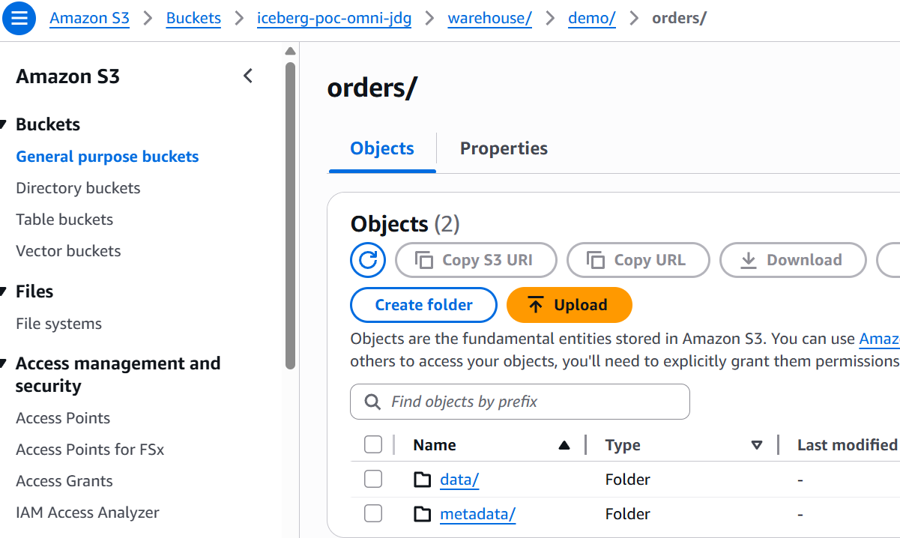
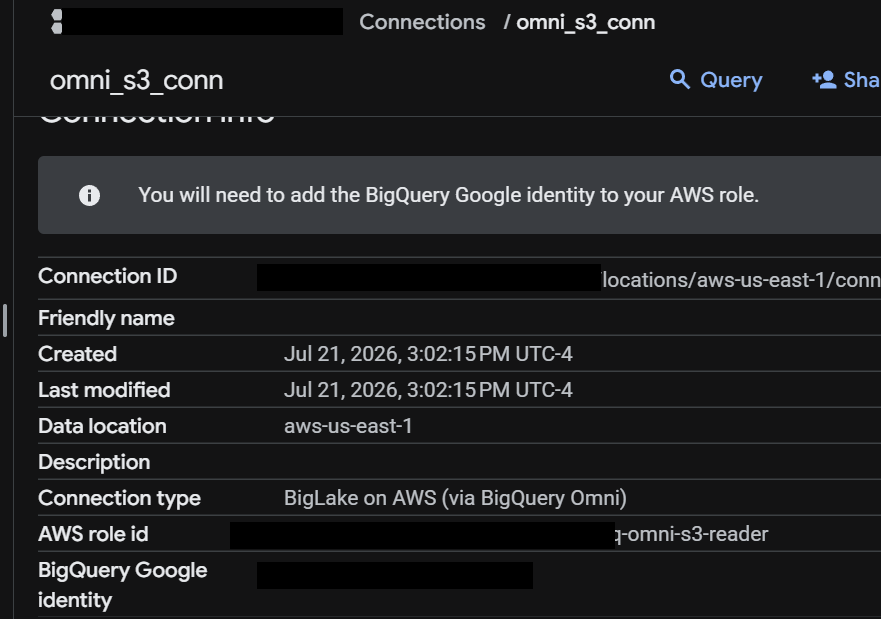
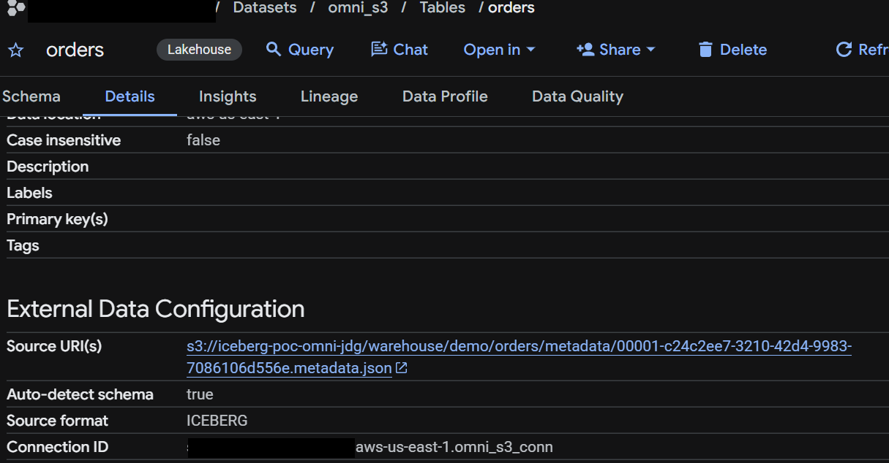
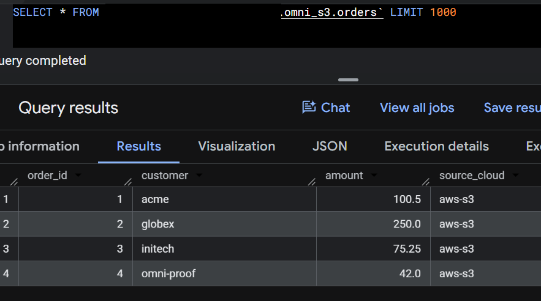
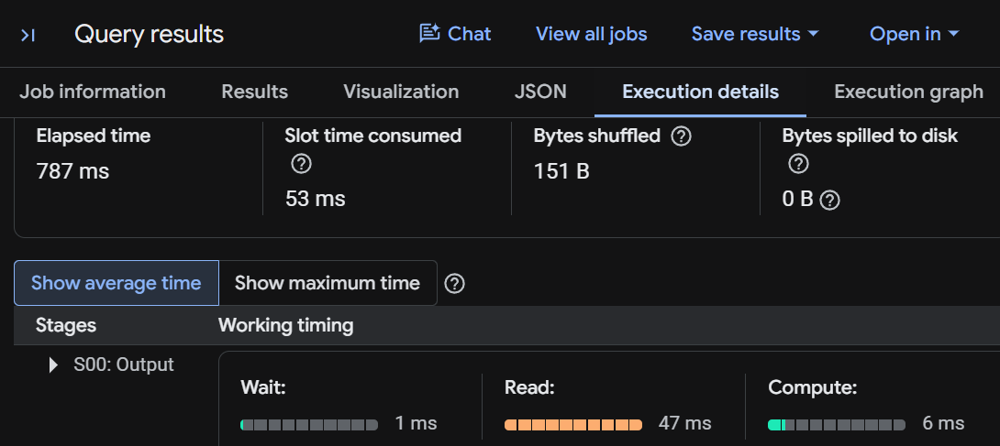
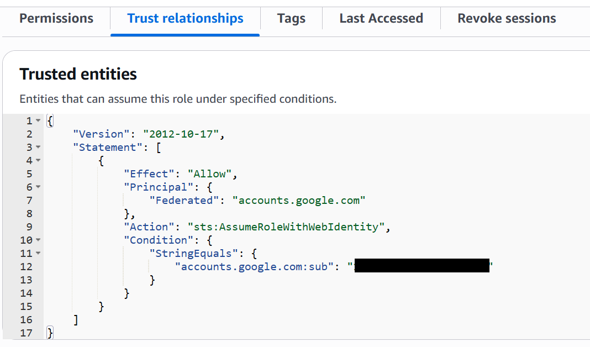
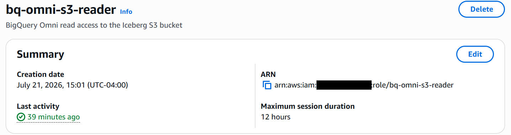
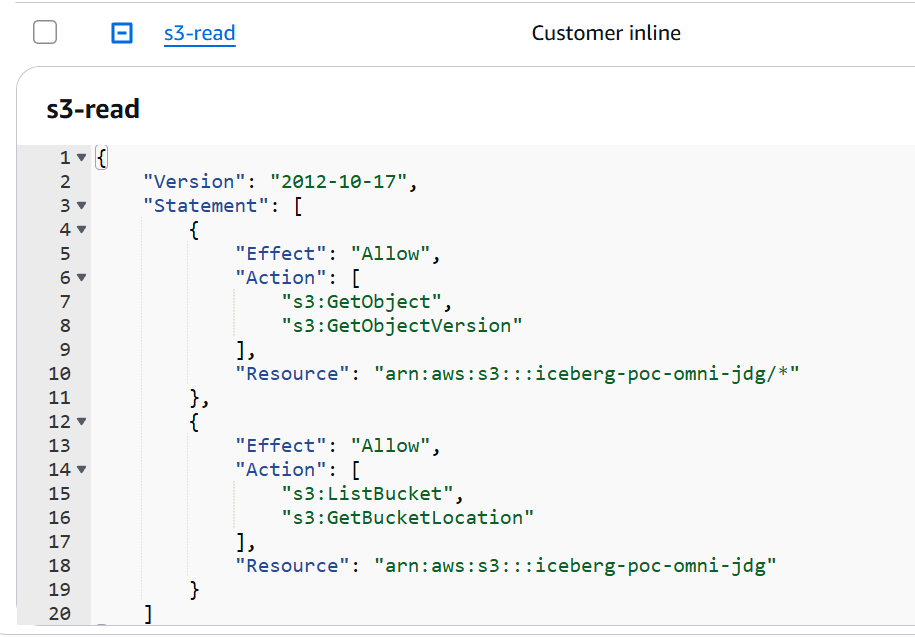

# Runbook: Reverse Direction — Read S3 Iceberg from GCP (BigQuery Omni)

The mirror image of the zero-copy federation path. Instead of Snowflake (AWS)
reading GCS-resident Iceberg, this reads **S3-resident Iceberg from BigQuery
(GCP)** — with no copy into GCS.

Executed successfully 2026-07-20 against a personal AWS account and the GCP
project used throughout this POC. Screenshots below have the project name, AWS
account id, and BigQuery identity redacted.

Decisions behind this leg live in a separate ADR set,
[`adr-omni-reverse/`](adr-omni-reverse/) (`R001`–`R005`). The control plane is
codified in [`terraform/omni-reverse/`](../terraform/omni-reverse/).

## The key architectural difference

In the GCS -> Snowflake direction, the consumer's compute lives in AWS and
**pulls raw bytes across the cloud boundary** — so every scan pays egress.

BigQuery Omni inverts this: Google runs **BigQuery compute inside AWS**, in the
S3 bucket's region, and executes the query next to the data. The raw data
never leaves AWS during the scan; only the (usually small) result set returns
to GCP. The per-scan bulk-egress problem of the other direction largely goes
away.

## Prerequisites

- The S3 data must be an **Iceberg table in a BigQuery Omni-supported AWS
  region**: `us-east-1`, `us-west-2`, `eu-west-1`, `eu-central-1`,
  `ap-northeast-2`, `ap-southeast-2`. (Our other POC data sits in `us-east-2`,
  which Omni does **not** cover — hence a fresh table in `us-east-1`.)
- Omni runs on-demand analysis pricing or Enterprise-edition reservations
  (no reservation required for on-demand). Standard and Enterprise Plus
  editions do not work in Omni regions.
- Local AWS credentials with S3 + IAM rights; `bq` CLI authed to the GCP
  project; `pyiceberg` for the table write (no Spark needed).

## Terraform alternative (control plane)

Steps 2–4 below are the manual (`aws`/`bq`) path, kept for understanding. The
same **control plane** — the AWS IAM role + web-identity trust + S3 policy, the
BigQuery connection, the dataset, and the external table — is codified as a
standalone module in
[`terraform/omni-reverse/`](../terraform/omni-reverse/). It breaks the
connection↔identity circular dependency automatically and uses a two-phase apply
for the table:

```bash
cd terraform/omni-reverse
terraform init && terraform apply            # connection, role, policy, dataset, bucket
python ../../scripts/omni_write_iceberg.py --bucket <omni_bucket>   # step 1 (data plane)
terraform apply -var 'omni_metadata_uri=s3://.../metadata/00001-....metadata.json'
```

Only **step 1 (writing the Iceberg data)** stays a script — that is data-plane
work, not infrastructure. Decisions behind this split:
[ADR-R004](adr-omni-reverse/R004-terraform-control-plane-script-data-plane.md).

## 1. Land an Iceberg table in an Omni region (S3)

`scripts/omni_write_iceberg.py` creates the bucket and writes a small Iceberg
table with PyIceberg — pure Python, no Spark/Dataproc/NAT. It prints the
`metadata.json` location BigQuery will point at.

```bash
python scripts/omni_write_iceberg.py --bucket <s3-bucket>   # region us-east-1
# -> METADATA_LOCATION: s3://<bucket>/warehouse/demo/orders/metadata/00001-....metadata.json
```

The Iceberg table lands as the standard `data/` + `metadata/` layout in S3:



## 2. AWS IAM role for BigQuery Omni to assume

Omni authenticates via **web-identity federation** (`accounts.google.com`), not
a static key. Create a role with a read-only S3 policy and a placeholder trust;
tighten the trust once BigQuery hands back its identity (step 3).

```bash
python scripts/omni_aws_role.py create --bucket <s3-bucket>
# -> role ARN
```

> **Terraform:** `aws_iam_role.omni` + `aws_iam_role_policy.omni_s3_read` in
> [`terraform/omni-reverse/main.tf`](../terraform/omni-reverse/main.tf) — the
> trust `sub` is wired to the connection identity automatically.

## 3. BigQuery Omni connection, then close the trust loop

```bash
bq mk --connection --connection_type='AWS' --location='aws-us-east-1' \
  --iam_role_id='<ROLE_ARN>' omni_s3_conn
# -> "Identity: '<NUMERIC_SUBJECT>'"

python scripts/omni_aws_role.py trust --identity <NUMERIC_SUBJECT>
```

> **Terraform:** `google_bigquery_connection.omni` — and because its
> `iam_role_id` is a constructed string, there is no manual trust handshake;
> `terraform apply` orders connection → role → policy for you.

Then raise the role's max session duration to 12 hours — Omni requires it:

```bash
aws iam update-role --role-name bq-omni-s3-reader --max-session-duration 43200
# (or the boto3 one-liner in scripts/omni_aws_role.py)
```

The finished connection — note it is `BigLake on AWS (via BigQuery Omni)`, pinned
to `aws-us-east-1`, and carries the AWS role id plus the BigQuery Google identity
you grant on the AWS side (project, account id, and identity redacted):



## 4. External Iceberg table + cross-cloud query

```sql
-- dataset must be in the Omni region
-- bq mk --location=aws-us-east-1 --dataset <project>:omni_s3

CREATE OR REPLACE EXTERNAL TABLE omni_s3.orders
  WITH CONNECTION `<project>.aws-us-east-1.omni_s3_conn`
  OPTIONS ( format = 'ICEBERG',
            uris = ['<METADATA_LOCATION from step 1>'] );

SELECT COUNT(*), ROUND(SUM(amount),2) FROM omni_s3.orders;
-- returned 4 / 467.75 in the POC — compute ran in AWS, only the result crossed back
```

> **Terraform:** `google_bigquery_dataset.omni` + `google_bigquery_table.orders`
> (the table is the phase-2 resource, gated on `omni_metadata_uri`).

The table registers as a `Lakehouse` external table whose source format is
`ICEBERG`, pointing straight at the S3 `metadata.json` — no bytes copied into GCP:



Querying it returns the real rows from S3, read in place:



The execution details are the proof that compute ran **in AWS** and almost
nothing crossed the boundary — **151 B shuffled**, 787 ms elapsed, 0 B spilled:



## Sharp edges (hit during the build)

| Symptom | Fix |
|---|---|
| `bq mk --properties '{"aws":...}'` -> "Unknown name aws" | Use the `--iam_role_id` flag form, not the `--properties` JSON, in current `bq`. |
| Query: "session duration of your IAM Role is smaller than requested" | Raise the role's `MaxSessionDuration` to `43200` (12h). |
| Data is in `us-east-2` | Not an Omni region — move/write it to `us-east-1` (or another supported region). |
| `pa.table(...)` ValueError: "numpy.dtype size changed" | Local numpy/pandas ABI mismatch — `pip install -U 'pandas>=2.2'` to match numpy 2.x. |

## How the auth works — keyless web-identity federation

No static AWS key is ever stored in GCP. The AWS role trusts a **Google
identity**, not a secret.

**One-time handshake (setup)**

1. `bq mk --connection` mints a Google identity — a numeric OIDC subject — for
   the connection.
2. You add that subject to the IAM role's trust policy (`accounts.google.com:sub`
   condition) and attach the read-only S3 policy.
3. Raise the role's max session duration to 12h (`43200s`) — Omni requires it.

**Every query (runtime)**

4. Omni requests an OIDC token from `accounts.google.com` for its identity.
5. Omni calls AWS STS `AssumeRoleWithWebIdentity`, presenting the token — no
   access key involved.
6. STS validates the trust (issuer + `sub`) and returns short-lived AWS
   credentials (≤ 12h).
7. Omni compute (in the AWS region) uses them to read the S3 Iceberg
   data/metadata; only results return to GCP.

Nothing to rotate, nothing to leak — credentials expire in hours.

The trust policy on the AWS role — a federated Google principal, the
`AssumeRoleWithWebIdentity` action, and the `sub` pinned to the connection's
identity (redacted):



The role's summary shows the required **12-hour** max session duration (account
id redacted):



Least privilege on the S3 side — read-only, scoped to the one bucket:



## Unsupported BigQuery features in Omni

Omni is not a full-feature BigQuery region. Per Google's documentation (verify
against current docs — the list evolves), these do **not** work in Omni regions:

- **DML** statements, and **DDL that manages data in BigQuery** (e.g. plain
  `CREATE TABLE`).
- **BigQuery ML** statements.
- **JavaScript UDFs.**
- **Streaming** (`tabledata.insertAll` / the Storage Write API).
- **The BigQuery Storage Read API** — the big one for downstream design (see
  below); it is unavailable in Omni regions.
- **Materialized views** over the external data, and **CMEK** on Omni datasets /
  external tables.
- **Querying destination temporary tables** with `SELECT`.
- **Result-size limits:** results > 256 MB with `ORDER BY` fail; results > 20 GiB
  can't be returned to GCP and must be **exported to S3** (see below).

Scheduled queries work only via the API/CLI with `EXPORT DATA`. Not every
BigQuery feature is covered here — confirm the specific ones your workload needs.

### The ">20 GiB" rule — exporting large results

This is about the query **result set**, not the table. When an Omni query's
result is too large to stream back to GCP, you export it. **The export is issued
from BigQuery (Omni), not a separate AWS-side job** — it runs inside Omni (in
AWS) and writes to **S3** (destination must be S3/Azure Blob, *not* GCS):

```sql
EXPORT DATA WITH CONNECTION `aws-us-east-1.omni_s3_conn`
  OPTIONS (uri = 's3://<bucket>/exports/orders/*', format = 'PARQUET')
AS SELECT * FROM omni_s3.orders WHERE <predicate>;
```

Two things to know:

- **Write permission.** The connection's IAM role must be able to **write** to
  S3 (`s3:PutObject`). Our least-privilege role (`scripts/omni_aws_role.py`) is
  read-only — for exports, add a `PutObject` statement on the export prefix, or
  use a separate write-capable connection.
- **It lands in S3, not GCP.** To consume the results in GCP you then read them
  back (Athena, the CDC reader, another Omni query) or cross-cloud transfer them.
  So a large-result workflow is: `EXPORT DATA` → S3 → consume/transfer.

## Downstream consumers — the one that changes the design

The intended consumers here are **Cloud Run, Compute Engine (Python), Notebooks,
Dataflow, Bigtable, and AlloyDB**. The critical thing to internalize:

> **Omni is a query surface, not a shared storage layer for GCP.** An Omni
> external table can be *queried* from BigQuery, but its bytes live in AWS. A
> GCP-native service cannot read the Omni table's storage directly — it consumes
> either (a) the small result set of a query, or (b) a GCP-side copy you
> materialize on purpose.

Two consumption shapes, and they have very different economics:

| Shape | How it works | Egress | Good for |
|---|---|---|---|
| **Query → small result** | Service runs SQL; Omni pushes the scan/filter/aggregate down in AWS and returns rows | Negligible (only the result crosses) | Aggregates, filtered slices, lookups |
| **Materialize → GCP copy** | `CREATE TABLE <native> AS SELECT … FROM <omni_table>` (cross-cloud transfer), a cross-cloud materialized view, or `EXPORT DATA` then load | Pays transfer on the **moved volume** | Feeding the raw/full dataset to GCP-native services |

Per consumer:

- **Cloud Run / Compute Engine (Python) / Notebooks.** Just the standard
  BigQuery client (the Jobs API) — point it at the connection's dataset and run
  SQL. **These clients do not need to run in the AWS region**; the query executes
  where the data lives and the result is returned to them wherever they are.
  Aggregates and filtered extracts come back cheaply; for a full extract,
  materialize first (below) or read S3 directly with the client's own AWS
  credentials (bypasses Omni entirely).
- **Dataflow.** The high-throughput path (`BigQueryIO` via the **Storage Read
  API**) does **not** support Omni tables. **Verified in this POC** with
  [`scripts/omni_storage_read_test.py`](../scripts/omni_storage_read_test.py) —
  a `create_read_session` on `omni_s3.orders` failed with
  `InvalidArgument: 400 ... Read API can be used to read temporary tables only in
  this region.` So you must land the data first — CTAS into a native BigQuery
  table (co-located with the Dataflow job's region), or `EXPORT DATA` — then
  read that. (Or give Dataflow an S3 connector and read the Iceberg files
  directly, skipping Omni.)
- **Bigtable / AlloyDB.** Neither can read S3 or an Omni table directly. Populate
  them from a **materialized GCP-side surface** (native BQ table or GCS export)
  via a pipeline (e.g. Dataflow). The cross-cloud transfer happens once, at
  materialization.

**Region, in one line:** query-driven clients (Cloud Run, Compute, Notebooks)
can live in any GCP region. Anything reading via the Storage Read API (Dataflow,
Spark) must read a **materialized native table** and run **in that table's GCP
region** — it can never read the Omni table directly.

**Design consequence.** If your consumers mostly need *aggregates or slices*,
Omni is ideal — push down in AWS, return small results, fan them out on GCP with
no bulk egress. If they need the *full dataset resident in GCP* on a schedule,
you are effectively copying anyway: a **cross-cloud materialized view** (kept
warm incrementally) or plain **Storage Transfer S3→GCS** is usually the cleaner,
cheaper answer than re-materializing through Omni on every run. Reach for a
cross-cloud MV when consumers are GCP-native and repeated; reach for pure Omni
query-in-place when the results are small relative to the scan.

## Alternative for streaming: incremental CDC straight from S3 (no Omni)

Because Dataflow/Spark can't read Omni (above), the instinct for a **streaming
sink** (Pub/Sub, Bigtable) is to materialize a GCP copy and stream from that.
For an *incremental* load that is wasteful — you only need the **new** rows, and
Iceberg's own metadata already describes them.

Every commit is a snapshot; an `APPEND` snapshot's new manifest lists exactly
the data files it added. So a consumer can read just the diff — plain Parquet in
S3, read with the object store's credentials — with **no query engine, no
Storage Read API, no Omni** in the path. This is, in effect, Iceberg CDC.

[`scripts/omni_incremental_cdc.py`](../scripts/omni_incremental_cdc.py)
implements it: track a snapshot **watermark**, walk snapshots added since it,
read each one's ADDED data files, emit to a sink, advance the watermark.

**Proven 2026-07-21** against `demo.orders`:

```text
sync #1 (no watermark)  -> full load, 4 rows, watermark set
append a batch          -> new snapshot
sync #2                 -> emitted ONLY the 3 new rows (the diff), not all 7
sync #3                 -> "up to date — no snapshots since ..."
end-to-end: appended again, published the diff to a Pub/Sub topic via the
            script's sink, and pulled the 2 new rows back from a subscription.
```

```bash
python scripts/omni_incremental_cdc.py append --rows 3                 # test snapshot
python scripts/omni_incremental_cdc.py sync   --sink stdout            # see the diff
python scripts/omni_incremental_cdc.py sync   --sink pubsub  --topic projects/<p>/topics/<t>
python scripts/omni_incremental_cdc.py sync   --sink bigtable --instance <i> --table-bt <t> --key-column order_id
```

**Caveat:** this covers **append-only** tables (the common event/streaming
case). Row-level deletes/overwrites (Iceberg delete files) need extra handling —
see [ADR-R006](adr-omni-reverse/R006-direct-s3-incremental-cdc.md). Run it from a
Cloud Run job, a scheduled container, or Dataflow with an S3 connector; give it
a least-privilege S3 read role and a durable watermark.

## Zero-copy (Omni) vs physical copy (into GCS)

| | **Omni read-in-place** | **Physical copy → GCS** (Storage Transfer) |
|---|---|---|
| Data at rest | Single copy, in S3 | Two copies (S3 + GCS) |
| Movement | Only query results cross | Full dataset on every sync |
| Cost shape | In-AWS scan (per TB) + transfer on results | Egress once per sync, then GCP-local reads |
| GCP engine reach | BigQuery / Spark only | **Any** GCP-native engine (Dataflow Storage API, AlloyDB load, etc.) |
| Freshness | Live against S3 | As fresh as the last transfer |
| Authoritative lake | Stays in S3 | Duplicated into GCS |
| Best when | Small results, occasional reads, S3 stays home | Full dataset needed by many GCP engines, or read-heavy |

## Estimated cost

Directional; confirm against current BigQuery pricing for your region.

- **Scan (Omni compute) = the "bytes billed" you see in the job.** On-demand ≈
  **$6.25 / TiB scanned**, metered in the AWS region. Partition/prune and select
  only needed columns — Iceberg + Parquet make this effective.
- **Cross-cloud transfer is a SEPARATE line item — not part of bytes billed.**
  The job's "bytes billed" reflects only the scan; it does **not** include
  cross-cloud transfer. Transfer is billed **per GB moved AWS→GCP** and applies
  when data physically crosses to GCP: cross-cloud joins, `CREATE TABLE AS
  SELECT` into a GCP region, materialized views, and large result returns. For
  query-and-return-small-result (like our POC — 151 B shuffled) it is a rounding
  error. For a full materialization it is the whole dataset size — roughly a
  one-time copy's egress, which is why repeated full materialization is a false
  economy. Budget the two components independently.
- **Reservations (does a commitment help?).** Yes, for **steady, heavy
  scanning**: buy BigQuery **Omni slot reservations** (Enterprise edition) in the
  AWS region instead of on-demand — the usual slot-commitment discount applies.
  For exploratory or bursty use, on-demand is simpler and cheaper. Note a
  reservation discounts **compute only** — it does **nothing** for cross-cloud
  transfer, so it does not rescue a materialize-everything pattern.
- **Storage.** One copy in S3 (S3 storage + request costs). No GCS duplicate
  unless you deliberately materialize.

## Query latency / impact

- **Cold query on the tiny POC table: ~3 seconds.** That includes cross-cloud
  coordination overhead you do not pay on a native table.
- At volume, expect roughly a native BigQuery scan of the same bytes **plus**
  cross-cloud coordination, **plus** transfer time proportional to result size.
  Keep result sets small to keep it snappy.
- **Analytics-grade, not interactive.** Fine for pipelines, reporting, and
  batch feature builds; not for sub-second serving. Put a materialized GCP-side
  table (or Bigtable/AlloyDB) in front of latency-sensitive consumers.

## Gotchas & learnings

- **Region lock.** Omni runs only in its supported regions (`us-east-1`,
  `us-west-2`, `eu-west-1`, `eu-central-1`, `ap-northeast-2`, `ap-southeast-2`).
  Our other data in `us-east-2` was simply unreachable — the region gates the
  whole approach, so check it *first*.
- **Storage Read API is unsupported on Omni tables** — the single biggest
  surprise for downstream design. Anything that reads BigQuery at high throughput
  (Dataflow, the Spark-BigQuery connector) needs a materialized native table or a
  GCS export, not the Omni table.
- **Cross-cloud joins/materialization have result-size limits and per-GB cost.**
  Moving large results erodes the no-egress benefit; that is the signal to switch
  to a scheduled copy.
- **Edition matters.** On-demand analysis pricing or Enterprise reservations
  only; Standard and Enterprise Plus do not run in Omni regions.
- **Not every BigQuery feature works under Omni** (e.g. streaming inserts, some
  DML, BI Engine). Validate the specific features your workload needs.
- **Operational trust details:** web-identity federation via `accounts.google.com`
  (no static key), the role needs a **12-hour** max session duration, and current
  `bq` wants the `--iam_role_id` flag, not `--properties` JSON.

## Teardown

```bash
bq rm -f -t <project>:omni_s3.orders
bq rm -r -f -d <project>:omni_s3
bq rm -f --connection --location=aws-us-east-1 omni_s3_conn
# AWS: delete role bq-omni-s3-reader, empty + delete the S3 bucket
```
