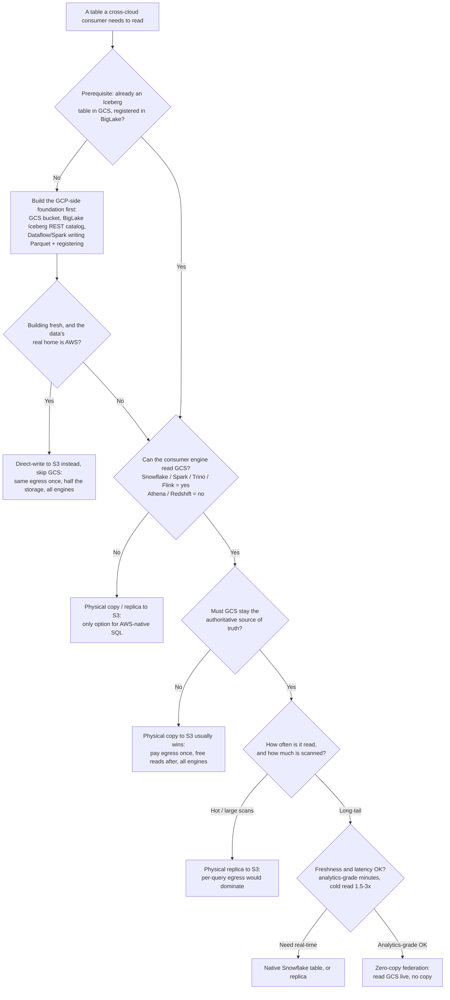

# Which Tables Fit Zero-Copy Federation?

A decision aid for deciding, per table, whether cross-cloud zero-copy
federation (a consumer engine reading GCS-resident Iceberg tables live) is the
right choice — or whether a physical copy, a direct write, or a native table
serves better.

Read the prerequisite first. It is not optional, and it changes the economics
of everything below it.

---

## Prerequisite — the GCP-side foundation does not exist today

Zero-copy federation reads an **Iceberg table that already lives in GCS and is
registered in a catalog**. None of that is in place today, so before any table
can be a candidate you (or the producing team) must stand up:

1. **GCS buckets** to hold the data and metadata.
2. **A BigLake Iceberg REST catalog** over those buckets (single-bucket mode is
   the simplest), with credential vending enabled.
3. **Ingestion that writes Iceberg to GCS and registers it** — e.g. a Dataflow
   job with a Pub/Sub source and a GCS sink, writing Parquet and committing to
   the catalog (or a Spark/Dataproc job for batch loads).

This is real, standing infrastructure with its own build and run cost. Treat it
as the price of admission, and weigh it against the payoff for the specific
tables in question.

> **A fork worth taking here:** if you are building this ingestion *fresh* and
> you already know the data's consumers live on AWS, it is usually better to
> write Iceberg **straight to S3** and skip GCS entirely — same one-time
> cross-cloud cost, half the storage, and it works for every AWS engine. Only
> keep the lake in GCS when GCS must remain the authoritative source of truth
> (see Q2). See [runbook-s3-replica.md](runbook-s3-replica.md) and
> [adr/0007-direct-write-over-replication.md](adr/0007-direct-write-over-replication.md).

---

## The decision tree

---

## Walking the tree in words

1. **Prerequisite gate.** If the table is not yet Iceberg-in-GCS-registered-in-BigLake,
   that foundation has to be built before zero-copy is even possible. If you are
   building fresh *and* the consumers are on AWS, strongly consider writing to S3
   directly rather than to GCS.

2. **Q1 — Consumer reach.** Athena and Redshift cannot read `gs://` at all — no
   catalog configuration fixes it. If either is a required consumer of this
   table, zero-copy federation is off the table for them; you must physically
   copy to S3.

3. **Q2 — Authoritative home.** If GCS does not need to stay the source of truth
   — the data's real home is AWS and no GCP-native engine reads it — a physical
   copy to S3 is usually the better answer: the cross-cloud cost is paid once at
   ingest, reads afterward are free and intra-region, and every AWS engine can
   read it.

4. **Q3 — Read economics.** Zero-copy meters cross-cloud egress on *every* scan
   (~$90-155/TB scanned). For a hot table hammered by dashboards, or a nightly
   job scanning terabytes, that recurring cost overtakes the one-time cost of a
   replica. Rule of thumb: if a table's monthly scanned bytes materially exceed
   its size, replicate it.

5. **Q4 — Freshness & latency.** Federation is analytics-grade: a streaming
   write lands in Iceberg in ~90 seconds and shows up in Snowflake 1-10 minutes
   later (measured), and cold cross-cloud scans run ~1.5-3x slower than a
   native table. If the workload needs real-time data or the fastest possible
   reads, use a native table or a replica instead.

---

## Quick checklist

A table is a **good fit for zero-copy federation** when *all* of these hold:

- [ ] It is (or will be) an Iceberg table in GCS, registered in BigLake
- [ ] Every consumer that needs it can read GCS — Snowflake, Spark, Trino, or Flink (not Athena/Redshift)
- [ ] GCS should remain the authoritative copy (GCP-native consumers read it too, or you want to avoid a duplicate)
- [ ] Reads are long-tail / infrequent — monthly scanned bytes stay well under the table's size
- [ ] Analytics-grade freshness (minutes) and cross-cloud read latency are acceptable

It is a **poor fit — copy or write to S3 instead** when *any* of these hold:

- [ ] Athena or Redshift must read it
- [ ] The data's real home is AWS and nothing on GCP needs it
- [ ] It is hot / frequently scanned, or scanned in large scheduled batches
- [ ] It needs real-time freshness or the lowest possible read latency

---

## The four outcomes

| Outcome | What it means | Where to look |
|---|---|---|
| **Zero-copy federation** | Consumer reads the GCS Iceberg table live, no copy. Default when GCS stays authoritative and reads are light. | [runbook-zero-copy.md](runbook-zero-copy.md) |
| **Physical copy / replica to S3** | A synced copy in S3, read intra-region. For AWS-native consumers or hot tables. | [runbook-s3-replica.md](runbook-s3-replica.md) |
| **Direct-write to S3** | New pipelines whose consumers are on AWS write Iceberg straight to S3, skipping GCS. | [adr/0007-direct-write-over-replication.md](adr/0007-direct-write-over-replication.md) |
| **Native table** | Load into the consumer's own storage. For real-time / lowest-latency needs. | consumer platform docs |

---

*Companion to [spec.md](spec.md), the [ADRs](adr/README.md), and the two
runbooks. Measured figures throughout are from the POC and should be
re-validated at production scale.*
